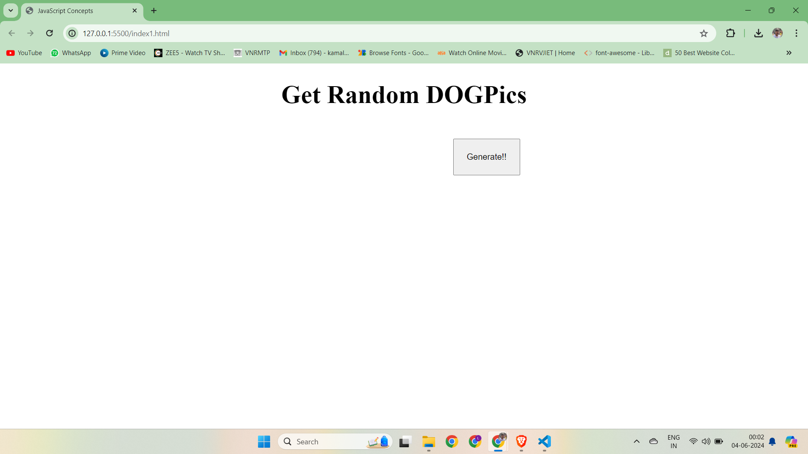
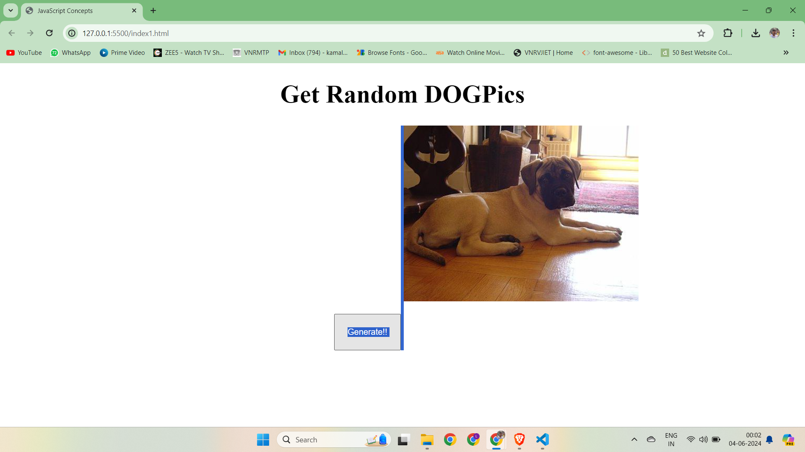
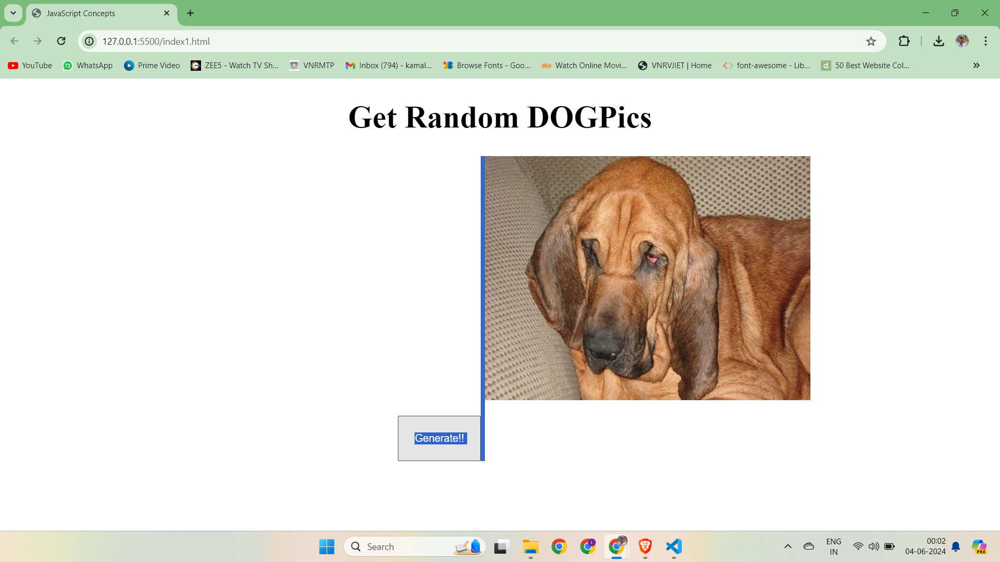

# generateDogPics


# Random Dog Picture Fetcher

This project fetches a random dog picture from the [Dog CEO's Dog API](https://dog.ceo/dog-api/) and displays it on a web page when a button is clicked.

## Table of Contents
- [Installation](#installation)
- [Usage](#usage)
- [Contributing](#contributing)
- [License](#license)

## Installation

1. **Clone the repository:**

    ```sh
    git clone https://github.comkamalkolisetty/generateDogPics.git
    cd random-dog-picture-fetcher
    ```

2. **Open the `index.html` file in your web browser:**

    Simply double-click on the `index.html` file or open it using your preferred web browser.

## Usage

1. **Open the `index.html` file:**
    - Open the `index.html` file in your web browser to see the interface.

2. **Click the "Get Dog Picture" button:**
    - Click the button to fetch and display a random dog picture.

## Project Structure

```plaintext
random-dog-picture-fetcher/
│
├── index.html
├── README.md
```

### index.html

The main HTML file that contains the structure and logic for fetching and displaying random dog pictures.

### README.md

This file, providing information about the project, how to install and use it, and other relevant details.

## Code Explanation

The `index.html` file contains:

- **HTML Structure:**
  - A button to trigger the fetching of the dog image.
  - An `img` element with the ID `result` to display the fetched image.

- **JavaScript:**
  - The `getDogPics` function fetches a random dog image from the Dog CEO API using Axios.
  - The button's click event is set up to call the `getDogPics` function, get the image URL, and set it as the `src` attribute of the `img` element.

- **Axios Library:**
  - The Axios library is included via a CDN to handle HTTP requests.

## Example Code

Here is a sample of the main code in `index.html`:

```html
<!DOCTYPE html>
<html lang="en">
<head>
    <meta charset="UTF-8">
    <meta name="viewport" content="width=device-width, initial-scale=1.0">
    <title>Random Dog Picture</title>
</head>
<body>
    <button>Get Dog Picture</button>
    

    <script>
        let btn = document.querySelector("button");

        btn.addEventListener("click", async () => {
            let link = await getDogPics();
            let image = document.querySelector("#result");
            image.setAttribute("src", link);
        });

        let url = "https://dog.ceo/api/breeds/image/random";

        async function getDogPics() {
            try {
                let result = await axios.get(url);
                return result.data.message;
            } catch (error) {
                console.log("ERRor", error);
                return "No image found";
            }
        }
    </script>
    <!-- Add a script tag to include axios library -->
    <script src="https://cdn.jsdelivr.net/npm/axios/dist/axios.min.js"></script>
</body>
</html>
```

## Demonstration










